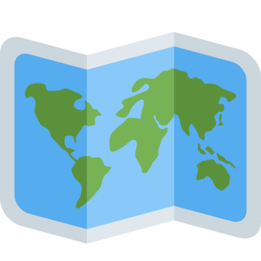

<p align="center">
  
</p>

# Map Marker

Map Marker is a Vue 3 application that allows you to display and manage location markers on a map, using Leaflet for the map and Vuetify for the UI components.

## Demo

You can view a live demo of the application at [Map Marker Demo](https://map-marker-wine.vercel.app/) _(temporarily available)_.

## Type Support for `.vue` Imports in TypeScript

By default, TypeScript does not support type checking for `.vue` imports. We use `vue-tsc` instead of `tsc` for type checking. For proper TypeScript language service support in your editor, install and enable [Volar](https://marketplace.visualstudio.com/items?itemName=Vue.volar).

## Customize Configuration

For more details on configuring Vite, visit the [Vite Configuration Reference](https://vite.dev/config/).

## Project Setup

To get started, clone this repository and install the dependencies:

```bash
pnpm install
```

### Compile and Hot-Reload for Development

To start the development server and enable hot reloading, run:

```bash
pnpm dev
```

### Type-Check, Compile, and Minify for Production

To prepare the application for production (type-check, build, and minify), run:

```bash
pnpm build
```

### Linting with [ESLint](https://eslint.org/)

To lint your codebase, run:

```bash
pnpm lint
```

To automatically fix linting issues, run:

```bash
pnpm lint-fix
```

### Formatting with [Prettier](https://prettier.io/)

To format your codebase with Prettier, run:

```bash
pnpm format
```

### Fix all (format and lint)

To fix formatting and linting issues in one go, run:

```bash
pnpm fix
```

## Docker Development Environment

This project is Dockerized for ease of development. You can use the `Makefile` commands to manage your Docker containers.

### Available Makefile Commands

- `help`: Show available commands and their descriptions.
- `clean`: Remove unused Docker data.
- `check-env`: Ensure the `.env` file exists.
- `dev-up`: Start development containers.
- `dev-up-and-shell`: Start containers and open a shell in the container.
- `dev-down`: Stop development containers.
- `dev-status`: Show the status of containers.
- `dev-logs`: Show logs from the containers.
- `dev-config`: Show Docker configuration.
- `dev-shell`: Start a shell in the development container.

### Example Usage:

To start the development containers:

```bash
make dev-up
```

To stop the containers:

```bash
make dev-down
```

For additional options and help, run:

```bash
make help
```

## Dependencies

This project uses the following major dependencies:

- **Vue 3** for the frontend framework.
- **Leaflet** for map handling.
- **Pinia** for state management.
- **Vuetify** for UI components.
- **Axios** for HTTP requests.
- **Tailwind CSS** for styling.

For the full list of dependencies, check the `package.json` file.

## Dev Dependencies

The project also includes several dev dependencies for linting, formatting, and TypeScript support:

- **ESLint** for linting.
- **Prettier** for code formatting.
- **TypeScript** for type checking.
- **Vue TS Config** and **Vue TSC** for Vue TypeScript support.

## License

This project is licensed under the MIT License - see the [LICENSE](LICENSE) file for details.
